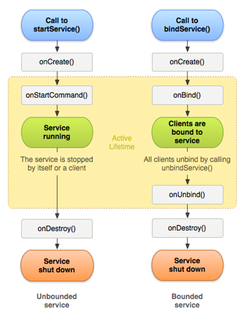

# 四大组件-Service

## 概述

### 定义

- 在后台运行，不可见，没有界面，优先级高于Activity

### 用途

- 播放音乐、记录地理位置变化等待

### 注意

- 运行在主线程，不能用它来做耗时操作
- 可以在服务中开一个线程，做耗时操作

## 分类

### 本地服务

在应用程序内部，通过start方式或bind方式启动，通过stop或unbind方式结束

### 远程服务

Android系统内部的应用程序之间

## 创建Service

### 步骤

**第一步：** 创建一个Class，继承自Service

**第二步：**在清单文件中注册Service

### 例子

```java
import android.app.Service;
import android.content.Intent;
import android.os.IBinder;
import android.support.annotation.Nullable;
import android.util.Log;

/**
 * Created by Kevin on 2016/9/19.
 * Description：
 */
public class MyStartService extends Service {
    private static final String TAG = "MyStartService";

    @Nullable
    @Override
    public IBinder onBind(Intent intent) {
        return null;
    }

    @Override
    public void onCreate() {
        super.onCreate();
        Log.d(TAG, "onCreate: ");
    }

    @Override
    public int onStartCommand(Intent intent, int flags, int startId) {
        Log.d(TAG, "onStartCommand: ");
        return super.onStartCommand(intent, flags, startId);
    }

    @Override
    public void onDestroy() {
        super.onDestroy();
        Log.d(TAG, "onDestroy: ");
    }
}
```

## 启动Service

启动Service分为两种方式，Start方式和Bind方式

### Start方法启动

#### 步骤

1. 实例化Intent对象

```java
  Intent intent = new Intent(this,MyStartService.class);
```

2. 启动服务

```java
  startService(intent);
```

3. 停止服务

```java
  stopService(intent);
```

#### 特点

- 服务和启动源没有任何关系
- 无法得到服务对象

### bind方式启动

#### 步骤

1. 在Service里定义一个内部类，该内部类需要继承Binder

   ```java
   public class MyBinder extends Binder{
    
   }
   ```

2. 在内部类中提供一个公共的方法返回当前服务实例

   ```java
   public class MyBinder extends Binder{
     //用来返回当前服务实例
     public MyBindService getService(){
       return MyBindService.this;
     }
   }
   ```

3. 修改onBind方法的返回值

   ```java
   public IBinder onBind(Intent intent) {
     return new MyBinder();
   }
   ```

4. 实例化Intent对象

   ```java
   Intent intent = new Intent(this, MyBindService.class);
   ```

5. 实例化一个ServiceConnection

   ```java
   ServiceConnectionconn = new ServiceConnection() {
     @Override
     public void onServiceConnected(ComponentName name, IBinder service) {
       //当服务和Activity发生绑定时执行
       myBindService = ((MyBindService.MyBinder)service).getService();
     }

     @Override
     public void onServiceDisconnected(ComponentName name) {
       //当服务和Activity异常 断开连接时执行
     }
   };
   ```

6. 绑定服务

   ```java
   bindService(intent, conn, BIND_AUTO_CREATE);
   ```

7. 解绑服务

   ```java
   unbindService(conn);
   ```

#### 特点

- 通过IBinder接口实例，返回一个ServiceConnection对象给启动源
- 通过ServiceConnection对象的相关方法可以得到Service对象

### 注意

在`unBindService`时，容易抛出异常，调用前应该前判断Service是否已经绑定。可以利用`bindService`方法的布尔类型的返回值来进行判断

```java
isBind = bindService(intent2,conn,BIND_AUTO_CREATE );
```

```java
if(isBind){
  unbindService(conn);
  isBind = false;
}else {
  Log.d(TAG, "服务未绑定，无需解绑");
}
```

## Service生命周期



## 常见的系统服务

### 获取当前网络是否连接

```java
private boolean isNetWorkConnected(Context context) {
	//获取网络连接管理器
	ConnectivityManager manager = (ConnectivityManager)
	                              context.getSystemService(CONNECTIVITY_SERVICE);
	//获取当前设备的网络连接信息
	NetworkInfo networkInfo = manager.getActiveNetworkInfo();
	//判断是否具有联网的能力
	if(networkInfo != null) {
		//此方法返回true说明网络连接，否则未连接
		return networkInfo.isAvailable();
	}
	//没有联网
	return false;
}
```

**注意：**需要添加权限：

```xml
<!--访问网络状态-->
<uses-permission android:name="android.permission.ACCESS_NETWORK_STATE"/>
```

### 打开或关闭WIFI

```java
WifiManager magager = (WifiManager) getSystemService(WIFI_SERVICE);
if(magager.isWifiEnabled()) { //wifi已打开
	magager.setWifiEnabled(false);
	Toast.makeText(SystemServiceActivity.this, "WIFI已关闭", Toast.LENGTH_SHORT).show();
} else {
	magager.setWifiEnabled(true);
	Toast.makeText(SystemServiceActivity.this, "WIFI已打开", Toast.LENGTH_SHORT).show();
}
```

**注意：**需要添加权限：

```xml
<!--修改WIFI状态-->
<uses-permission android:name="android.permission.CHANGE_WIFI_STATE" />
<!--访问WIFI状态-->
<uses-permission android:name="android.permission.ACCESS_WIFI_STATE"/>
```

